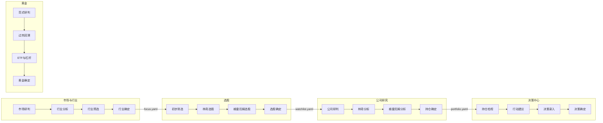

# Dashboard v2.9 设计方案

> **状态**：Proposed（文档已定，代码未动）  
> **日期**：2026-06-18  
> **关联**：[10-子单元规范](./10-dashboard-investment-flow-plan.md) · [11-数据漏斗](./11-dashboard-data-funnel.md) · [ADR-0003](./adr/0003-dashboard-investment-flow.md)

---

## 一、设计目标

| 问题（v2.8） | 目标（v2.9） |
|--------------|--------------|
| 5 个 Tab 功能并列，决策顺序不清 | 投资流水线：先分析 → 再选择 → **末格确定** |
| 行业分析与选择混在一页 | 拆成「行业分析」+「行业预选」+「行业确定」 |
| 选股单页混排多种大师 | 林奇 / 格雷厄姆独立子单元 + 选股确定 |
| 公司研究缺落仓环节 | 末格「持仓确定」写 portfolio |
| 跨导航数据无层次 | **层次递进漏斗**：全市场 → 行业 → 股票 → 持仓 → 决策 |

---

## 二、统一子单元规范

每个顶级导航下设 **4 个 sub-tab**：

```
[分析/研判] → [筛选/论证] → [深化/预选] → [✅ 确定]
```

| 规则 | 说明 |
|------|------|
| 末格 | 必须是「确定」，汇总本导航结论并落盘 |
| 前 3 格 | 只读或 `session_state` 草稿，**不写 YAML** |
| 删除 | 在**本导航确定页**管理本层名单（增删改） |
| 跳转 | 确定后可 `goto()` 下一导航第一步 |

### 确定页 UI 骨架

```
┌─ 本层已确认清单（可勾选删除）──────────────────┐
├─ 待确认草稿（前序子单元带入）──────────────────┤
├─ 一致性检查（如 focus ↔ watchlist 孤立警告）────┤
└─ [确认新增] [删除选中] [跳转下一导航 →] ─────────┘
```

---

## 三、投资主流程



数据如何在导航间传递，见 [11-dashboard-data-funnel.md](./11-dashboard-data-funnel.md)。

---

## 四、五个导航详细设计

### 4.1 市场 & 行业

| # | sub-tab | 类型 | 职责 | 持久化 |
|---|---------|------|------|--------|
| 1 | 市场研判 | 分析 | 康波、温度计、权益仓位建议 | 无 |
| 2 | 行业分析 | 分析 | 周期、估值分位、Top7、ETF、行业知识（只读） | 无 |
| 3 | 行业预选 | 选择 | 勾选待关注行业、权重/类型草稿 | session |
| 4 | **行业确定** | 确定 | 汇总清单；删行业；写 focus | **focus_industries.yaml** |

**代码映射**：`tabs/market/` · `tabs/industry/{analysis, preselect, confirm}.py`（从 `industry_focus.py` 拆出）

**删除策略**：删行业时 **仅警告** watchlist 孤立股，不自动级联删除。

---

### 4.2 选股

| # | sub-tab | 类型 | 职责 | 持久化 |
|---|---------|------|------|--------|
| 1 | 初步筛选 | 筛选 | universe = `expand(focus_industries)`；多维粗筛 | session |
| 2 | 林奇选股 | 论证 | 六类 + PEG + 财务护栏 | session |
| 3 | 格雷厄姆选股 | 论证 | 四类价值 + 格氏数/NCAV | session |
| 4 | **选股确定** | 确定 | 合并命中；删观察股；写 watchlist | **watchlist.yaml** |

**代码映射**：`screener.py` → `tabs/screener/{prelim, lynch_pick, graham_pick, confirm}.py`

**约束**：`focus_industries.yaml` 为空时，提示先完成「行业确定」。

---

### 4.3 公司研究

侧边栏「当前公司」为本导航上下文。

| # | sub-tab | 类型 | 职责 | 持久化 |
|---|---------|------|------|--------|
| 1 | 公司研判 | 分析 | Hero + block_a~d；芒格清单（expandable） | 无 |
| 2 | 林奇分析 | 论证 | 原 `lynch_analysis` 六步 | 无 |
| 3 | 格雷厄姆分析 | 论证 | 原 `graham_analysis` 五步 | 无 |
| 4 | **持仓确定** | 确定 | 聚合前三格；填持仓意图；建仓/观察 | **portfolio.yaml + decisions.duckdb** |

**芒格**：独立 sub-tab 收入「公司研判」expandable，保持 4 格上限。

**确定页聚合**：五维分、fair_price、林奇六类、格雷厄姆路由、芒格清单分、watchlist 状态。

---

### 4.4 决策中心

| # | sub-tab | 类型 | 职责 | 持久化 |
|---|---------|------|------|--------|
| 1 | 持仓检视 | 分析 | 全景表、权重饼、浮盈、F-Score | 无 |
| 2 | 行动建议 | 筛选 | 收件箱、再平衡提案、偏离告警 | session |
| 3 | 决策录入 | 选择 | 买卖表单、智能录入、历史草稿 | session |
| 4 | **决策确定** | 确定 | 批量应用调仓/买卖 | **portfolio + decisions** |

**变化**：原垂直三段 → 4 sub-tab；月报降为 expander 或确定后链接。

---

### 4.5 黄金

| # | sub-tab | 类型 | 职责 | 持久化 |
|---|---------|------|------|--------|
| 1 | 范式研判 | 分析 | 三大范式投票 + 关键指标（原 ①② 合并） | 无 |
| 2 | 过热回溯 | 分析 | 过热扫描 + 策略回溯（原 ④⑥ 合并） | 无 |
| 3 | ETF 与杠杆 | 选择 | ETF 选择 + 金股杠杆；仓位草稿 | session |
| 4 | **黄金确定** | 确定 | 汇总建议；确认配置比例与工具 | **portfolio 黄金段** |

**变化**：7 sub-tab 收敛为 4；原「持仓建议」迁入确定页。

---

## 五、导航常量（`navigation.py` + `app.py`）

```python
# 市场 & 行业
SUB_MARKET_JUDGE       = "市场研判"
SUB_INDUSTRY_ANALYSIS  = "行业分析"
SUB_INDUSTRY_PRESELECT = "行业预选"
SUB_INDUSTRY_CONFIRM   = "行业确定"

# 选股
SUB_SCREENER_PRELIM    = "初步筛选"
SUB_SCREENER_LYNCH     = "林奇选股"
SUB_SCREENER_GRAHAM    = "格雷厄姆选股"
SUB_SCREENER_CONFIRM   = "选股确定"

# 公司研究
SUB_COMPANY_RESEARCH   = "公司研判"
SUB_COMPANY_LYNCH      = "林奇分析"
SUB_COMPANY_GRAHAM     = "格雷厄姆分析"
SUB_COMPANY_CONFIRM    = "持仓确定"

# 决策中心
SUB_DC_REVIEW          = "持仓检视"
SUB_DC_ACTIONS         = "行动建议"
SUB_DC_INTAKE          = "决策录入"
SUB_DC_CONFIRM         = "决策确定"

# 黄金
SUB_GOLD_PARADIGM      = "范式研判"
SUB_GOLD_OVERHEAT      = "过热回溯"
SUB_GOLD_ETF           = "ETF与杠杆"
SUB_GOLD_CONFIRM       = "黄金确定"
```

---

## 六、目标模块目录

```
.tools/dashboard/tabs/
├── market/
├── industry/
│   ├── analysis.py
│   ├── preselect.py
│   └── confirm.py
├── screener/
│   ├── prelim.py
│   ├── lynch_pick.py
│   ├── graham_pick.py
│   └── confirm.py
├── company/              # + holding_confirm.py
├── lynch_analysis.py
├── graham_analysis.py
├── decision/
│   ├── holdings_table.py
│   ├── action_inbox.py
│   ├── intake.py
│   └── confirm.py
├── decision_center.py
└── gold_analysis/        # 收敛为 4 sub-tab

.tools/dashboard/funnel/   # P0 起实现
    ├── layers.py
    ├── orphans.py
    └── session.py
```

---

## 七、引擎复用（不重写业务逻辑）

| 能力 | 模块 |
|------|------|
| 行业分位/周期 | `industry/percentile_engine.py` · `state.py` |
| 行业→股票 Top7 | `industry/screener.py` |
| 林奇/格雷厄姆 | `masters/lynch/` · `masters/graham/` |
| 多维筛选 | `screening/screener.py` |
| 观察池 | `watchlist.py` |
| 持仓 | `portfolio/loader.py` |
| 决策日志 | `decisions/db.py` |
| 黄金 | `gold/paradigm.py` · `overheat.py` |

---

## 八、v2.8 → v2.9 对照

| 导航 | v2.8 | v2.9 |
|------|------|------|
| 市场&行业 | 2 格（周期 + 行业分析混选） | 4 格，末格行业确定 |
| 选股 | 1 页混排 | 4 格，林奇/格雷厄姆分立 |
| 公司研究 | 4 格含芒格，无落仓 | 4 格，末格持仓确定 |
| 决策中心 | 3 段垂直 | 4 格，末格决策确定 |
| 黄金 | 7 格 | 4 格，末格黄金确定 |

---

## 九、实施分期

| 期 | 范围 | 交付 |
|----|------|------|
| P0 | 市场 & 行业 | `funnel/` 骨架 + 4 sub-tab + 行业确定（含删除与孤立警告） |
| P1 | 选股 | 4 sub-tab + watchlist 确定/删除 |
| P2 | 公司研究 | 持仓确定 |
| P3 | 决策中心 | 4 sub-tab |
| P4 | 黄金 | 7→4 收敛 |
| P5 | 全局 | navigation + goto 串联 + 冒烟测试 |

---

## 十、相关文档

| 文档 | 内容 |
|------|------|
| [11-dashboard-data-funnel.md](./11-dashboard-data-funnel.md) | 跨导航数据共享、层次漏斗、组内删除 |
| [10-dashboard-investment-flow-plan.md](./10-dashboard-investment-flow-plan.md) | 子单元规范原文 |
| [05-dashboard.md](./05-dashboard.md) | v2.8 现状 |
| [06-config-and-state.md](./06-config-and-state.md) | 配置与 session 约定 |
