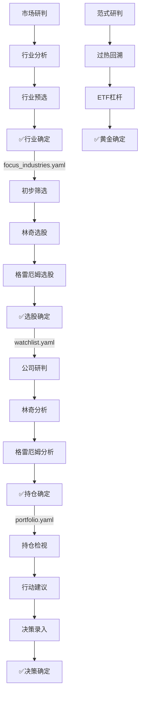

# Dashboard 子单元设计规范（v2.9）

> **状态**：Partially Implemented — P0（市场&行业）+ P1（选股）已落地；P2–P4 待实施（见第八节）  
> **日期**：2026-06-18（规范）/ 2026-06-28（进度校准）  
> **前置**：[05-dashboard.md](./05-dashboard.md) · [ADR-0003](./adr/0003-dashboard-investment-flow.md)

---

## 〇、统一设计原则

每个**顶级导航**（左侧 radio 5 页）下设 **3～4 个 sub-tab 小单元**，结构固定为：

```
[分析/研判] → [筛选/论证] → [可选第三格] → [✅ 确定]
     ↑              ↑              ↑            ↑
   只读为主      可选/对比      深化可选     末格必为「确定」
```

| 规则 | 说明 |
|------|------|
| **数量** | 每导航 **3 或 4** 个 sub-tab，不增减顶级 Tab |
| **末格** | **最后一个 sub-tab 一定是「确定」**，汇总本导航前序小单元的结论，允许用户编辑后落盘 |
| **顺序** | 先分析、后选择、最后确认；禁止在确定页之前写入持久化配置 |
| **草稿** | 前序小单元结论进 `st.session_state` 或内存草稿；仅确定页写 YAML / DuckDB |
| **命名** | 末格统一 `✅ {领域}确定`（如「行业确定」「选股确定」） |
| **跳转** | 确定成功后 `goto()` 下一导航第一步，或停留并展示「已确认」徽章 |

### 确定页通用 UI 骨架

```
┌─ 摘要条：本导航已完成的分析/筛选结论（只读 + 可展开明细）─┐
├─ 可编辑区：权重 / 备注 / 理由 / 参数微调 ─────────────────┤
├─ 对照提示：与上游配置一致性检查（如 focus ↔ watchlist）────┤
└─ [确认写入]  [取消]  [跳转下一导航 →] ─────────────────────┘
```

### 跨导航流水线



---

## 一、🌡️ 市场 & 行业（4 小单元）

| # | sub-tab | 类型 | 职责 | 持久化 |
|---|---------|------|------|--------|
| 1 | **市场研判** | 分析 | 康波/温度计/权益仓位建议；宏观结论卡片 | 无 |
| 2 | **行业分析** | 分析 | L2 周期、估值分位、Top7、ETF 对标、行业知识（只读） | 无 |
| 3 | **行业预选** | 选择 | 从分析页勾选待关注行业；权重/类型草稿 | session 草稿 |
| 4 | **✅ 行业确定** | **确定** | 汇总预选清单；冲突检查；写入 `focus_industries.yaml` | **写 YAML** |

**现状映射**：① `tabs/market/` · ② `industry_focus.py`（拆出分析区）· ③④ 新建 `tabs/industry/selection.py` + `confirm.py`

**确定页输出**：
```yaml
# .config/focus_industries.yaml
focus:
  - industry: 白酒
    type: stalwart
    weight: 1.0
    confirmed_at: "2026-06-18"
    note: "PE 分位 35%，周期复苏早期"
```

**Session**：`market_macro_stance` · `industry_draft_focus[]` · `industry_confirmed_at`

---

## 二、🔍 选股（4 小单元）

| # | sub-tab | 类型 | 职责 | 持久化 |
|---|---------|------|------|--------|
| 1 | **初步筛选** | 筛选 | universe = `focus_industries` 成份；多维粗筛；勾选候选 | session |
| 2 | **林奇选股** | 论证 | 六类分类 + PEG + 财务护栏；对候选评分排序 | session |
| 3 | **格雷厄姆选股** | 论证 | 四类价值路由 + 格氏数/NCAV；对候选评分排序 | session |
| 4 | **✅ 选股确定** | **确定** | 合并 ①②③ 命中；去重；备注；写入观察池 | **写 watchlist.yaml** |

**现状映射**：`screener.py` 拆为 `tabs/screener/{prelim,lynch_pick,graham_pick,confirm}.py`

**确定页输出**：
```yaml
# .config/watchlist.yaml
entries:
  - ticker: "600519"
    name: 贵州茅台
    preset: 林奇+格雷厄姆
    score: 82
    status: pending
    notes: "双大师命中，待公司研究"
```

**Session**：`screener_prelim[]` · `screener_lynch_hits[]` · `screener_graham_hits[]` · `screener_pending_confirm[]`

**下游**：确定后推荐 `goto(PAGE_COMPANY, company=...)`

---

## 三、🏢 公司研究（4 小单元）

侧边栏「当前公司」为本导航上下文；sub-tab 围绕**同一家公司**展开。

| # | sub-tab | 类型 | 职责 | 持久化 |
|---|---------|------|------|--------|
| 1 | **公司研判** | 分析 | Hero + block_a~d；五维/雪花图/大师矩阵；**含芒格清单入口**（折叠区） | 无 |
| 2 | **林奇分析** | 论证 | 原 `lynch_analysis` 六步框架 | 无 |
| 3 | **格雷厄姆分析** | 论证 | 原 `graham_analysis` 五步框架 | 无 |
| 4 | **✅ 持仓确定** | **确定** | 聚合 ①②③ 结论；填 school/rationale/weight/price_band；建仓或观察 | **写 portfolio.yaml + decisions.duckdb** |

**现状映射**：
- ① `tabs/company/`（block 内嵌芒格速览，完整芒格仍可从 block 链到原 `munger_analysis` 子视图）
- ②③ 保留 `lynch_analysis` / `graham_analysis` 为独立 sub-tab
- ④ 新建 `holding_confirm.py`

> **芒格处理**：独立 `munger_analysis` sub-tab 降为 ① 内「芒格多元思维」expandable，以满足 4 格上限且不丢能力。

**确定页输入聚合**：

| 来源 | 字段 |
|------|------|
| 公司研判 | 五维分、fair_price 走廊、block_a 结论 |
| 林奇分析 | 六类、PEG、护栏通过项 |
| 格雷厄姆分析 | 四类路由、安全边际档位 |
| 芒格（block 内） | 决策清单加权分、心理偏差项 |
| 观察池 | 是否已在 watchlist |

**确定页输出**：`portfolio.holdings[]` 更新 + `decisions.insert(action=买入|观察, snapshot=...)`

---

## 四、💼 决策中心（4 小单元）

| # | sub-tab | 类型 | 职责 | 持久化 |
|---|---------|------|------|--------|
| 1 | **持仓检视** | 分析 | 持仓全景表、权重饼、浮盈、行业集中度、F-Score | 无 |
| 2 | **行动建议** | 筛选 | 行动收件箱、再平衡提案、偏离度告警 | session 勾选 |
| 3 | **决策录入** | 选择 | 买卖决策表单、智能录入、历史决策列表（草稿） | session |
| 4 | **✅ 决策确定** | **确定** | 汇总 ②③ 待执行项；确认调仓/买卖；批量落盘 | **写 portfolio.yaml + decisions.duckdb** |

**现状映射**：
- ① `decision/holdings_table.py`
- ② `decision/action_inbox.py` + `rebalance_planner`
- ③ `decision_center.py` 决策日志段 + 智能录入
- ④ 新建 `decision/confirm.py`

**与 v2.8 差异**：原三段式（总览/日志/月报）垂直堆叠 → 改为 4 sub-tab；**月报历史**降为 ① 底部 expander 或 ④ 确定后的归档链接。

**确定页能力**：
- 应用再平衡提案 `apply_proposals()`
- 批量决策 `decisions.insert()`
- 更新持仓 shares/cost_basis/status

---

## 五、🥇 黄金（4 小单元）

| # | sub-tab | 类型 | 职责 | 持久化 |
|---|---------|------|------|--------|
| 1 | **范式研判** | 分析 | 三大范式投票 + 关键指标面板（合并原 ①②） | 无 |
| 2 | **过热回溯** | 分析 | 短期过热扫描 + 策略回溯（合并原 ④⑥） | 无 |
| 3 | **ETF 与杠杆** | 选择 | ETF 选择 + 金股 ETF 杠杆视图；勾选目标 ETF/仓位草稿 | session |
| 4 | **✅ 黄金确定** | **确定** | 汇总范式/过热/ETF 建议；确认黄金配置比例与工具 | **写 portfolio 黄金段或 decisions** |

**现状映射**：`gold_analysis/` 7 sub-tab 收敛为 4；原 ⑦ `position_advisor` 逻辑迁入 ④ 确定页

**确定页输出**（草案）：
```yaml
# .config/portfolio.yaml 扩展段或 holdings 中黄金 ETF 条目
gold_allocation:
  target_pct: 0.08
  dominant_paradigm: P2
  instruments: [518880, ...]
  confirmed_at: "2026-06-18"
  rationale: "P2 主导 + 过热未触发，维持 8%"
```

---

## 六、导航常量一览（`navigation.py` + `app.py`）

```python
# 市场 & 行业
SUB_MARKET_JUDGE     = "市场研判"
SUB_INDUSTRY_ANALYSIS = "行业分析"
SUB_INDUSTRY_PRESELECT = "行业预选"
SUB_INDUSTRY_CONFIRM  = "行业确定"

# 选股
SUB_SCREENER_PRELIM  = "初步筛选"
SUB_SCREENER_LYNCH   = "林奇选股"
SUB_SCREENER_GRAHAM  = "格雷厄姆选股"
SUB_SCREENER_CONFIRM = "选股确定"

# 公司研究
SUB_COMPANY_RESEARCH = "公司研判"
SUB_COMPANY_LYNCH    = "林奇分析"
SUB_COMPANY_GRAHAM   = "格雷厄姆分析"
SUB_COMPANY_CONFIRM  = "持仓确定"

# 决策中心
SUB_DC_REVIEW        = "持仓检视"
SUB_DC_ACTIONS       = "行动建议"
SUB_DC_INTAKE        = "决策录入"
SUB_DC_CONFIRM       = "决策确定"

# 黄金
SUB_GOLD_PARADIGM    = "范式研判"
SUB_GOLD_OVERHEAT    = "过热回溯"
SUB_GOLD_ETF         = "ETF与杠杆"
SUB_GOLD_CONFIRM     = "黄金确定"
```

---

## 七、模块目录目标结构

```
.tools/dashboard/tabs/
├── market/              # ① 市场研判
├── industry/
│   ├── analysis.py      # ② 行业分析
│   ├── preselect.py     # ③ 行业预选
│   └── confirm.py       # ④ 行业确定
├── screener/
│   ├── prelim.py
│   ├── lynch_pick.py
│   ├── graham_pick.py
│   └── confirm.py
├── company/             # ① 公司研判 (+ holding_confirm.py)
├── lynch_analysis.py    # ②
├── graham_analysis.py   # ③
├── decision/
│   ├── holdings_table.py
│   ├── action_inbox.py
│   ├── intake.py        # ③ 决策录入（从 decision_center 抽出）
│   └── confirm.py       # ④ 决策确定
├── decision_center.py   # 编排 4 sub-tab
└── gold_analysis/       # 收敛为 4 sub-tab 编排
```

---

## 八、实施分期（更新）

| 期 | 导航 | 交付 | 状态 |
|----|------|------|------|
| P0 | 市场 & 行业 | 4 sub-tab 骨架 + 行业确定写 focus.yaml | ✅ 已落地（`tabs/industry/` + `funnel/`） |
| P1 | 选股 | 4 sub-tab + 选股确定写 watchlist.yaml | ✅ 已落地（`tabs/screener/`） |
| P2 | 公司研究 | 4 sub-tab + 持仓确定写 portfolio | ⏳ 未实施（仍 v2.8 概览/林奇/格雷厄姆/芒格） |
| P3 | 决策中心 | 4 sub-tab + 决策确定批量落盘 | ⏳ 未实施（仍 v2.8 总览/跟踪/日志/月报） |
| P4 | 黄金 | 多 sub-tab→4 收敛 + 黄金确定 | ⏳ 未实施 |
| P5 | 全局 | navigation 常量 + 跨导航 goto + 冒烟测试 | ⏳ 部分（market/screener 常量已建） |

---

## 九、相关文档

- [05-dashboard.md](./05-dashboard.md)
- [06-config-and-state.md](./06-config-and-state.md)
- [11-dashboard-data-funnel.md](./11-dashboard-data-funnel.md) — **跨导航数据共享、层次漏斗、组内删除**
- [12-dashboard-v2.9-design-scheme.md](./12-dashboard-v2.9-design-scheme.md) — **完整设计方案（推荐阅读）**
- [adr/0003-dashboard-investment-flow.md](./adr/0003-dashboard-investment-flow.md)
