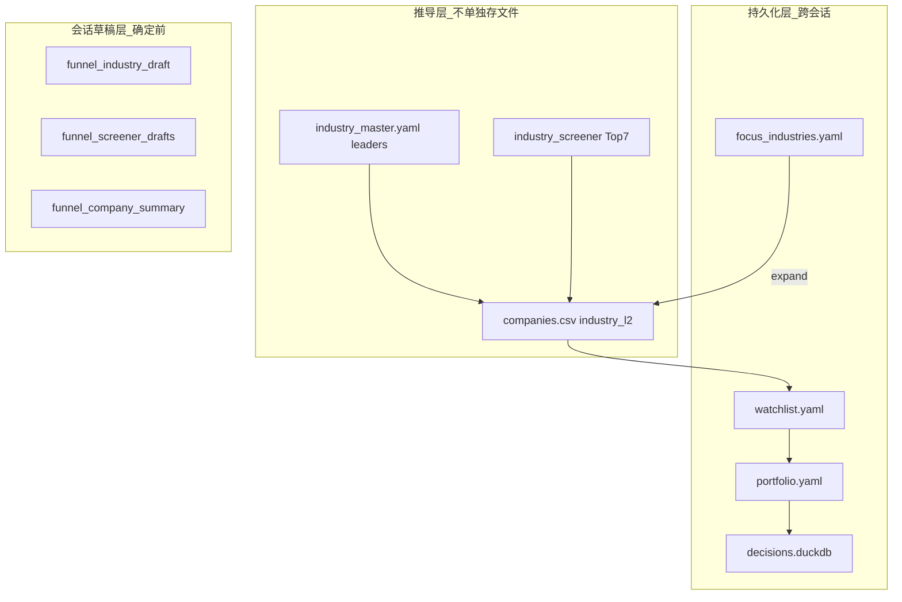
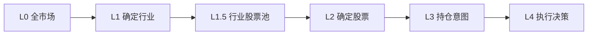

# Dashboard 数据漏斗与跨导航共享

> **状态**：Partially Implemented — `funnel/` 模块（layers/orphans/session）已落地，行业&选股导航已接入；公司/决策/黄金导航待 P2–P4  
> **日期**：2026-06-18（设计）/ 2026-06-28（进度校准）  
> **前置**：[12-dashboard-v2.9-design-scheme.md](./12-dashboard-v2.9-design-scheme.md) · [06-config-and-state.md](./06-config-and-state.md)

本文回答：**不同导航栏之间数据如何共享？** 以及 **如何层次递进缩小范围、并在本层删除？**

---

## 一、三层存储 + 一层推导



### 1.1 持久化层（L0–L4）

| 层级 | 文件 | 含义 | 写入导航·子单元 | 读取方 |
|------|------|------|-----------------|--------|
| L0 | `companies.csv` + `market.duckdb` | 全市场标的 | 脚本维护 | 行业分析、粗筛 |
| L1 | `.config/focus_industries.yaml` | **已确定行业** | 市场&行业 · 行业确定 | 选股 universe 上限 |
| L1.5 | **推导**（无文件） | 行业包含的股票池 | 运行时计算 | 行业 Top7、选股初步筛选 |
| L2 | `.config/watchlist.yaml` | **已确定观察股** | 选股 · 选股确定 | 公司研究入口 |
| L3 | `.config/portfolio.yaml` | **已确定持仓意图** | 公司研究 · 持仓确定 | 决策中心检视 |
| L4 | `data/decisions.duckdb` | 买卖留痕 | 持仓确定 / 决策确定 | 时间线、审计 |

### 1.2 行业 → 股票池展开（L1.5 推导）

行业确定 **不存股票列表**；选股时的 universe 由行业名动态展开：

```
focus_industries[].industry
    → companies.csv WHERE industry_l2 = industry
    → ∪ industry_master.yaml.leaders
    → ∪ industry_screener.screen_industry() Top7
    = 该行业可用股票池
```

**现有实现基础**：

| 能力 | 路径 |
|------|------|
| 行业读写 | `.tools/dashboard/state.py` — `add_focus` / `remove_focus` / `get_focus_list` |
| 行业→股票 | `.tools/dashboard/industry/screener.py` — 三级降级（market.duckdb → peers → companies.csv） |
| 行业主索引 | `.config/industry_master.yaml` — `leaders` 字段 |
| 公司行业映射 | `.config/companies.csv` — `industry_l2` 列 |

**已落地**（见第六节）：`funnel/layers.py` — `expand_focus_to_tickers()` / `get_screener_universe()` 统一封装上述 join，避免各 Tab 重复逻辑。

---

## 二、层次递进漏斗



每个顶级导航 **只负责收窄一层**：

| 导航 | 输入范围 | 本层产出 | 末格确定写入 |
|------|----------|----------|--------------|
| 市场 & 行业 | 全市场行业 | N 个 focus 行业 | `focus_industries.yaml` |
| 选股 | focus 行业内股票池 | M 只 watchlist | `watchlist.yaml` |
| 公司研究 | watchlist 中当前公司 | 1 只持仓意图 | `portfolio.yaml` |
| 决策中心 | portfolio 全部持仓 | 批量调仓/买卖 | portfolio + decisions |
| 黄金 | 宏观黄金信号 | 黄金配置比例 | portfolio 黄金段 |

### 2.1 递进示例

1. **行业确定**后 `focus` = `[白酒, 股份制银行, 保险]`
2. **选股初步筛选** universe ≈ 白酒成份（茅台、五粮液…）+ 银行成份 + 保险成份的并集
3. **选股确定**后 `watchlist` = `[600519, 600036]`（子集）
4. **持仓确定**对 `600519` 写入 `portfolio.holdings[]`（再次收窄为建仓意图）
5. **决策确定**执行具体股数/调仓并写 `decisions.duckdb`

若 `focus_industries.yaml` 为空，选股 Tab 显示：**请先完成「行业确定」**。

---

## 三、会话草稿层（导航组内、确定前）

前 3 个子单元 **不写 YAML**；第 4 格「确定」一次性落盘并清空草稿。

| 导航组 | session key（草案） | 内容 | 确定后 |
|--------|---------------------|------|--------|
| 市场&行业 | `funnel_industry_draft[]` | 预选行业 + 权重/备注 | clear → 写 focus |
| 选股 | `funnel_screener_prelim[]` | 粗筛候选 ticker | |
| 选股 | `funnel_screener_lynch_hits[]` | 林奇命中 | |
| 选股 | `funnel_screener_graham_hits[]` | 格雷厄姆命中 | clear → 写 watchlist |
| 公司研究 | `funnel_company_summary` | 各格结论摘要 | clear → 写 portfolio |
| 决策中心 | `funnel_dc_pending_actions[]` | 待执行调仓/买卖 | clear → 批量落盘 |
| 黄金 | `funnel_gold_draft` | ETF/仓位草稿 | clear → 写 portfolio 黄金段 |

**已落地**：`funnel/session.py` 统一读写上述 key（`get_draft` / `set_draft` / `clear_draft` / `clear_all_for_nav`），避免魔法字符串散落。

---

## 四、跨导航跳转桥接

### 4.1 `navigation.goto()`

实现：`.tools/dashboard/navigation.py`

```python
goto(PAGE_SCREENER, sub_tab="初步筛选", focus={"from_industry": "白酒"})
goto(PAGE_COMPANY, company="06_贵州茅台", sub_tab="公司研判")
goto(PAGE_DC, sub_tab="决策录入", prefill={"price": 1650.0, "reason": "加仓"})
```

| 字段 | 用途 |
|------|------|
| `page` | 目标顶级导航（与 `app.py` PAGE_* 一致） |
| `sub_tab` | 目标子单元标签 |
| `company` | 侧边栏公司 folder（公司研究/决策中心） |
| `focus` | 行业名、ticker 等上下文 |
| `prefill` | 表单预填（价格、理由模板） |

### 4.2 流转机制

1. 调用方 `goto()` → 写入 `st.session_state["nav_intent"]` → `st.rerun()`
2. `app.py` 路由层 `peek_intent()` 在 selectbox 渲染前覆盖 page/company
3. 目标 Tab `consume_intent()` 应用 `sub_tab` / `focus` / `prefill` 后清空

### 4.3 推荐跳转链

| 从 | 到 | 触发时机 |
|----|-----|----------|
| 行业确定 | 选股 · 初步筛选 | 确定成功后按钮「去选股」 |
| 选股确定 | 公司研究 · 公司研判 | 点击 watchlist 中某股 |
| 持仓确定 | 决策中心 · 持仓检视 | 建仓成功后 |
| 决策确定 | — | 停留并展示「已执行」徽章 |

---

## 五、组内删除设计

每个导航的 **确定页** 同时是本层名单管理：可增、可删、可改。

| 导航·确定页 | 删除对象 | API | 级联策略 |
|-------------|----------|-----|----------|
| 行业确定 | 某关注行业 | `state.remove_focus(industry)` | **warn_only**：不自动删 watchlist |
| 选股确定 | 某观察股 | `watchlist.remove(ticker)` | 不影响 focus；已建仓显示只读 |
| 持仓确定 | 降级/清仓 | `portfolio` status → watch/exited | 可选 `decisions.insert` |
| 决策确定 | 撤销待执行 | 清 session 草稿 | 不影响已确认 YAML |

### 5.1 孤立股票警告（warn_only）

用户确认策略：**删行业时不自动级联删除 watchlist**。

删行业「白酒」时 UI 展示：

```
⚠️ 观察池中仍有 2 只股票属于「白酒」：600519、000858
   它们不会自动移除。可在「选股确定」中手动删除。
```

**已落地**：`funnel/orphans.py`

```python
def find_orphan_watchlist(focus_names: set[str]) -> list[dict]:
    """返回 industry_l2 不在 focus_names 中的 watchlist 条目。"""
```

删除前/后均调用，作为一致性检查区块。

### 5.2 确定页删除 UI

```
┌─ 本层已确认清单（可勾选删除）──────────────────┐
│  ☑ 白酒  ☑ 股份制银行  ☐ 保险                  │
├─ 待确认草稿（前序子单元带入）──────────────────┤
├─ 一致性检查（孤立 watchlist 警告）──────────────┤
└─ [确认新增] [删除选中] [跳转下一导航 →] ──────────┘
```

---

## 六、`funnel/` 模块（已落地）

```
.tools/dashboard/funnel/
    ├── __init__.py
    ├── layers.py      # L0-L4 读取；expand_focus_to_tickers()；get_screener_universe()
    ├── orphans.py     # find_orphan_watchlist()
    └── session.py     # 草稿 key 读写；get/set/clear_draft、clear_all_for_nav
```

| 函数 | 职责 |
|--------------|------|
| `layers.get_focus_industries()` / `get_focus_names()` | 读 L1 |
| `layers.expand_focus_to_tickers()` | L1 → L1.5 并集 |
| `layers.get_screener_universe()` | 选股 universe（DataFrame） |
| `layers.get_watchlist_tickers()` | 读 L2 |
| `orphans.find_orphan_watchlist()` | focus ↔ watchlist 一致性 |
| `session.get_draft / set_draft / clear_draft / clear_all_for_nav` | 草稿生命周期 |

各 Tab 确定页统一调用 `funnel.*`，不各自 join CSV。

---

## 七、配置 schema 速查

### focus_industries.yaml

```yaml
focus:
  - industry: 白酒          # 必须匹配 industry_master.name
    type: stalwart
    weight: 1.0
    confirmed_at: "2026-06-18"   # v2.9 新增（确定页写入）
    note: ""
top_n: 7
market_cap_min: 5000000000
```

### watchlist.yaml

```yaml
entries:
  - ticker: "600519"
    name: 贵州茅台
    added_at: "2026-06-18"
    preset: 林奇+格雷厄姆
    score: 82
    status: pending          # pending | closed
    notes: ""
    source_industry: 白酒    # v2.9 新增（追溯所属行业，便于孤立检测）
```

### portfolio.yaml

见 [06-config-and-state.md](./06-config-and-state.md)。v2.9 持仓确定写入 `holdings[]`；黄金确定可写 `gold_allocation` 扩展段。

---

## 八、与现有代码的差异

| 现状 | v2.9 目标 |
|------|-----------|
| `industry_focus.py` 分析与写 focus 同页 | 分析只读，仅「行业确定」写入 |
| `screener.py` 对全公司或弱 focus 筛选 | universe 强制来自 `expand(focus)` |
| `screener` 部分路径写 `.temp/watchlist.md` | 统一 `watchlist.yaml` |
| 无跨层一致性检查 | 确定页展示孤立警告 |
| session key 分散 | `funnel/session.py` 集中管理 |

---

## 九、相关文档

| 文档 | 内容 |
|------|------|
| [12-dashboard-v2.9-design-scheme.md](./12-dashboard-v2.9-design-scheme.md) | 五导航完整设计方案 |
| [10-dashboard-investment-flow-plan.md](./10-dashboard-investment-flow-plan.md) | 子单元规范 |
| [adr/0003-dashboard-investment-flow.md](./adr/0003-dashboard-investment-flow.md) | 架构决策（含删除策略） |
